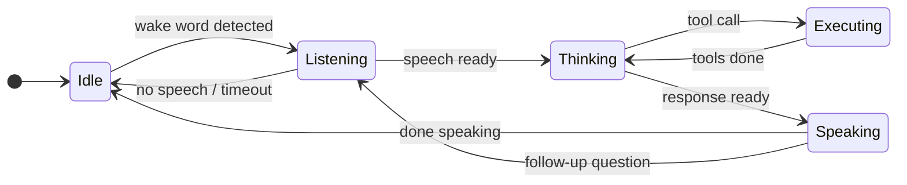

# JARVIS State Machine

```mermaid
stateDiagram-v2
    direction LR
    [*] --> Idle

    Idle --> Listening : wake word detected
    Listening --> Thinking : speech ready
    Listening --> Idle : no speech / timeout

    Thinking --> Executing : tool call
    Executing --> Thinking : tools done
    Thinking --> Speaking : response ready

    Speaking --> Idle : done speaking
    Speaking --> Listening : follow-up question
```
